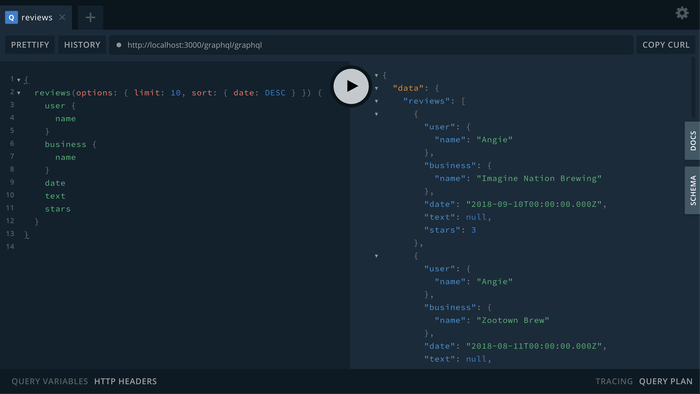

<!-- [](https://grandstack.io/deploy-starter-netlify) [](https://grandstack.io/deploy-starter-vercel) [](https://sandbox.neo4j.com/?usecase=blank-sandbox) -->

# GRANDstack Demo Starter

```
npm install https://github.com/drugz/demo2.git
```
<!-- 
```
npx create-grandstack-app myNewApp
``` -->


This project is a starter for building a [GRANDstack](https://grandstack.io) (GraphQL, React, Apollo, Neo4j Database) application. There are two components to the starter, the web frontend application (in React and Angular flavors) and the API app (GraphQL server).

The starter represents a **business reviews dashboard**. You need to adjust the GraphQL schema, the seed data, database index creation, and the UI components for your use-case.


## Quickstart with Docker Compose

You can quickly start via:

```
docker-compose up -d
```


### Open In Browser.
Not this


## <a name="overview"></a> Overview

The GRANDstack Starter is a monorepo that includes a GraphQL API application and client web applications for React (default) and Angular for a business reviews dashboard.

### `/` - Project Root

The root directory contains some global configuration and scripts:
<!-- 
- `npm run start` and `npm run build`
- ESLint (.eslintrc.json) for code linting
- Prettier (.prettierrc.json) for code formatting
- Git hooks for applying formatting on commit -->

 # Open GraphQL Editor
by link http://localhost:4001/graphql
### [`/api`](./api)




# Open Neo4j browser

by link 


This directory contains the GraphQL API application using Apollo Server and the Neo4j GraphQL Library.

- Change environment variable settings in `.env`:

```
# Use this file to set environment variables with credentials and configuration options
# This file is provided as an example and should be replaced with your own values
# You probably don't want to check this into version control!

NEO4J_URI=bolt://localhost:7687
NEO4J_USER=neo4j
NEO4J_PASSWORD=letmein

# Uncomment this line to enable encrypted driver connection for Neo4j
#NEO4J_ENCRYPTED=true

# Uncomment this line to specify a specific Neo4j database (v4.x+ only)
#NEO4J_DATABASE=neo4j

GRAPHQL_SERVER_HOST=0.0.0.0
GRAPHQL_SERVER_PORT=4001
GRAPHQL_SERVER_PATH=/graphql

```

### [`/web-react`](./web-react)


The frontend React web application is found in this directory.

It includes:

- Material UI
- React router
- Apollo Client / React Hooks
- Create React App

 SOON
### [`/mobile_client_flutter`](./mobile_client_flutter) 


A mobile client built with [Flutter](https://flutter.dev) which supports Android, iOS, and web. See the [README](./mobile_client_flutter/README.md) for detailed setup instructions.


